# Gitlab Board

gitlab-board is a tool for project manager to quickly create issue in gitlab board

## Summary

-   [Introduction](#introduction)
-   [Utilisation](#get-started)
    -   [Consult board](#consult-board)
    -   [Setup application](#setup-application)
    -   [Create a new board from gitlab-board](#create-a-new-board-from-gitlab-board)
    -   [Add new project/milestone in a board](#add-new-projectmilestone-in-a-board)
    -   [Add issue](#add-issue)
    -   [Consult issue in milestone](#consult-issue-in-milestone)
    -   [Debug mode](#debug-mode)
    -   [Installation](#installation)
    -   [Update application](#update-application)
-   [Covered functionnalities](#covered-functionnalities)
-   [Architecture](#architecture)

## Introduction

This tool allow to following precisely all developpement in multiple repository.  
This tool can generate a board in gitlab and allow to handle milestone and issue in this board.  
Every milestone represent a project in gitlab.

Final result in GUI  
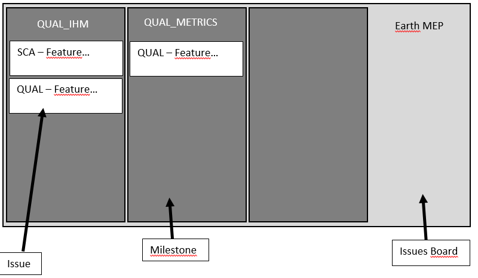

## Get started

Here's the GUI
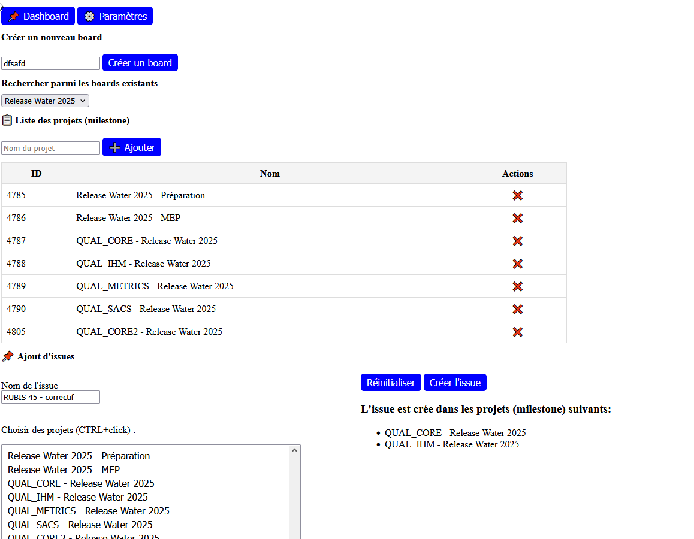

##### Consult board

1. Go in GitLab
2. Create issue board for operational phase
3. Create a milestone for each repository
    > Automatically Associate the milestone le Milestone à l’Issues Board
4. In each milestone, add issue by functionalities
5. In gitlab go on the issue and create branch and MR
6. You can add labels for priority

##### Setup application

1. Go a this link : https://gitlab.com/-/user_settings/personal_access_tokens
2. Click on `Add new token`
   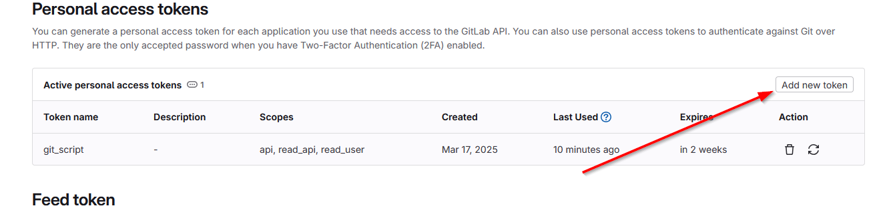
3. Filled Token Name : `gitlab-board`
4. Add a year for expiration date
5. Select following scopes: `api`, `read_api`, `read_user`
6. Copy generated token
7. Launch html file `index.html` in a browser
8. Go in parameters section and seized token at step 3
   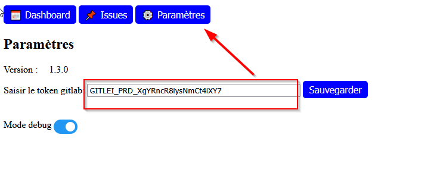
9. Go back to Dashboard section and select dashboard to add new projects/issues

##### Create a new board from gitlab-board

1. Seize in the input `Board name` - the name of your board
2. Click on `Create board`
   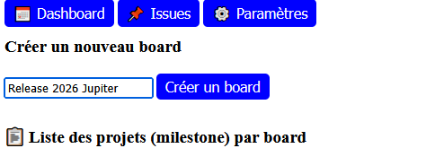
3. You can consult the board at the linke like below:
   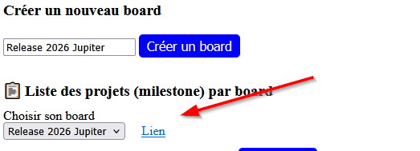

> By default, 2 milestones are created at this board (Prep phase and operational phase)

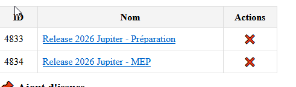

##### Add new project/milestone in a board

>  The milestone has to be a name of repository

1. Select board where you want to add milestone
2. Seize the name of the milestone in input `Name of the project`
3. Click on `Add` button  
   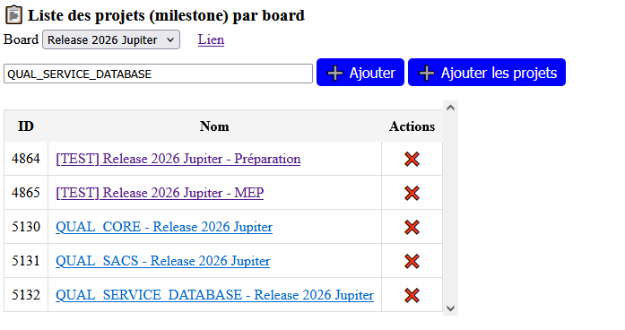

> The button `Add default project` allowed to add default projects automatically like belowed

    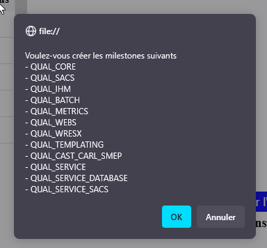

##### Add issue

1. Seize name of the issue `Name of the issue`
2. Select milestones (CTRL+click to select multiple milestone)
3. Click on `Create issue` button
4. Check the result in the right section  
   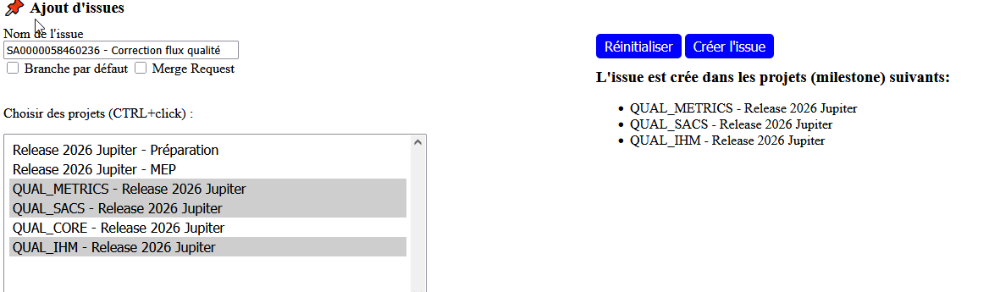

> The state of board at this step

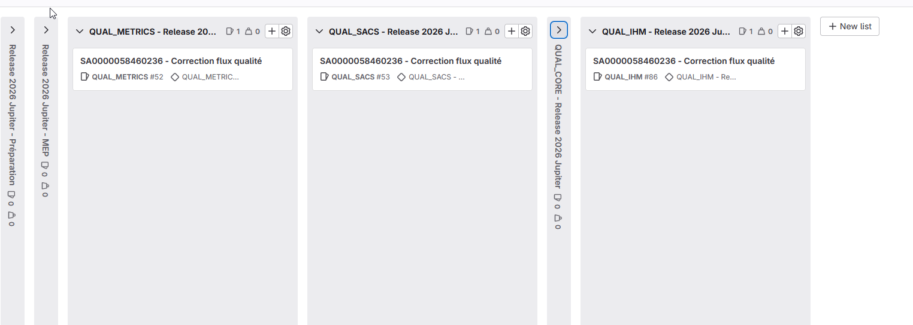

##### Consult issue in milestone

1. Go in `Issues` tab
2. Select board and milestone
3. See the issue table
   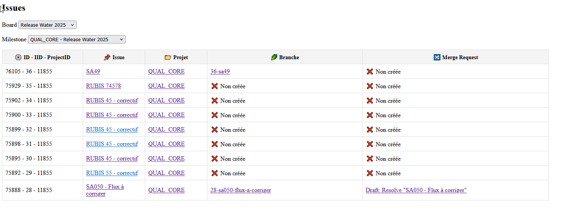

> Issues flag in red are closed  
> Merge requests
>
> -   en white are opened
> -   en blue are merged
> -   en red are closed

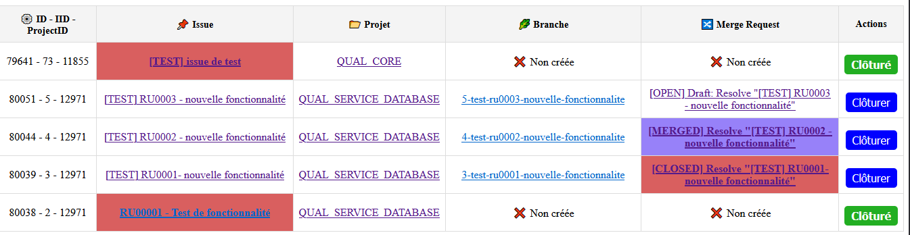

##### Debug mode

For trouble-shooting

1. Go in `Parameters` and activate debug mode
2. at the bottom of the page, a yellow block will displayed with informations  
   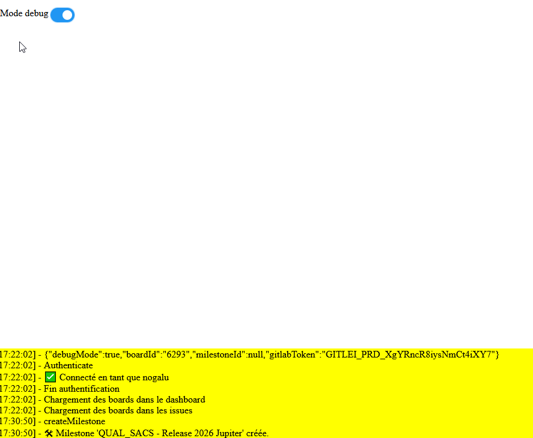

#### Installation

1. Open git bash from his computer
   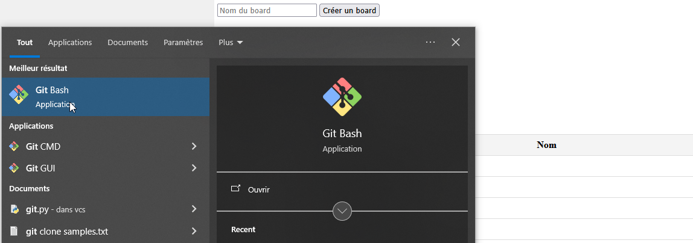
2. Seize following commands

```
git clone https://github.com/NY-Daystar/gitlab-board
```

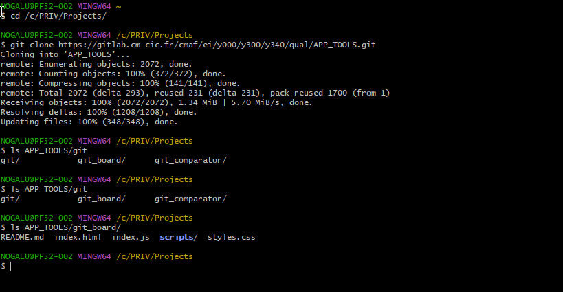  
3. Open from browser (chrome, firefox, edge) the project with the file `index.html`

> Vous can pin in favorites

[A logs console (yellow block is available for trouble-shootings)](#debug-mode)

4. Configure your token in this section
   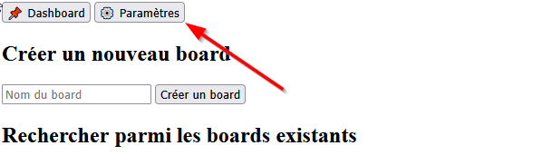

5. Generate your token from gitlab page: https://gitlab.com/-/user_settings/personal_access_tokens
    > Add following scopes: `api`, `read_api`, `read_user`

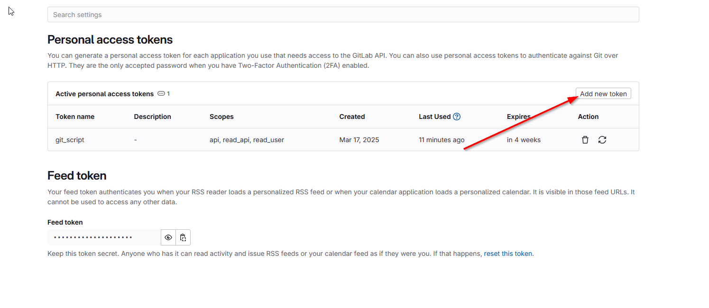

6. Save and go back in dashboard section

Les steps are done and you can

-   Create a new board
-   Consult a board with its milestones
-   Create a new milestone and an existing board

#### Update application

1. Seize following commands

```
git pull
```

2. Open from browser (chrome, firefox, edge) the project with the file `index.html`

## Covered functionnalities

✔️ Create board in input
✔️ Generate automatically milestones with default milestones [Preparation phase, operationnal phase]  
✔️ Create issues from several milestones  
✔️ Detect branch created in issue  
✔️ Detect merge request created in issue  
✔️ Add labels for priority (high, medium, low)  
✔️ Tabs to organize interface  
✔️ Logs in console to check exectution  
✔️ Handle erreur when authenticate in Gitlab  
✔️ Close issues

## Architecture

We're using this REST API: https://docs.gitlab.com/api/group_boards/#list-group-issue-board-lists

```
/gitlab-board-manager
│── index.html          # GUI with tabs
│── index.js            # Handle tabs and main display
│── styles.css          # App styles
│── /scripts
│   │── api.js          # Read/Write methods with Gitlab
│   │── auth.js         # Handle Gitlab authentication
│   │── board.js        # Handle Gitlab boards (creation, selection, update, delete)
│   │── config.js       # Configuration for user with Gitlab token
│   │── console.js      # Console to display exectution application
│   │── constants.js    # Hard data for application
│   │── issues.js       # Handle Gitlab issues (creation, selection, update, delete)
│   │── milestone.js    # Handle Gitlab milestone (creation, selection, update, delete)
│   │── loader.js       # Display with CSS a load when loading data
│   │── parameters.js   # Handle in parameters tab (new version available, debug mode, etc...)
│   │── toast.js        # Display of notifier at the bottom of the page
│   │── utils.js        # Utilities methods and regex
```
